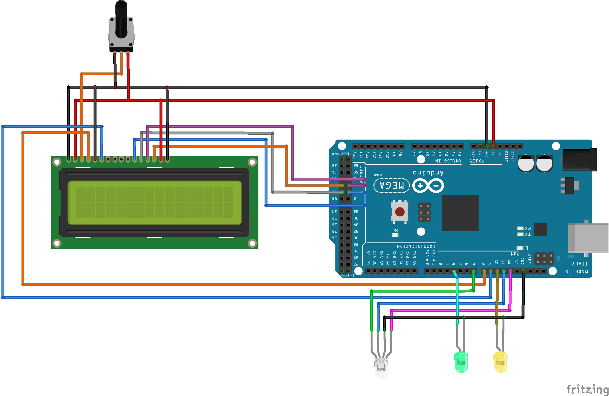
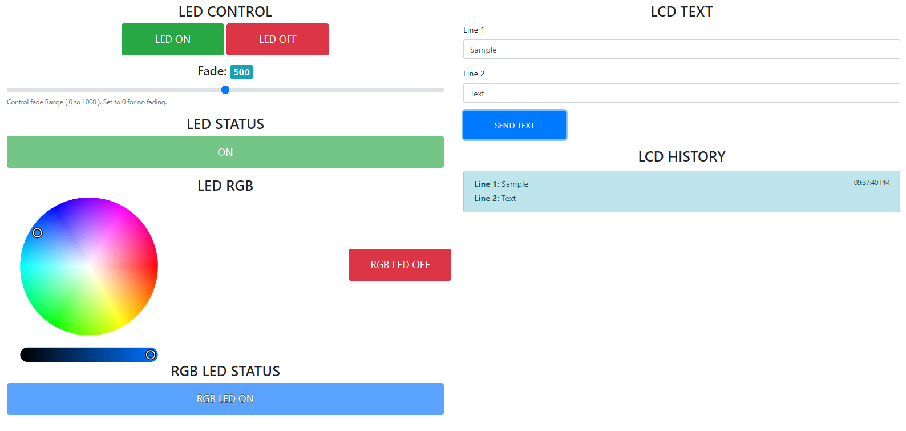

# ArduinoControl with Firmata
A Test project to play a little bit with firmata, johnny-five and socket.io

## Getting Started

This project use:
* Arduino Mega, with Firmata installed, for details on 
how to install firmata : https://github.com/firmata/arduino
* StandardFirmata sketch was upload into the arduino.
* Arduino Mega with stuff connected in the following diagram
* Jhonny-five framework as firmata javascript client using nodeJS (https://github.com/rwaldron/johnny-five)
 
When running it allows to control : 
* 2 Leds ON/OFF with a configurable fade (using PWM)  
* 1 RGB LED using a color picker (https://github.com/jaames/iro.js)
* 1 LCD 1602




### Installing
* Install dependencies
```
npm install 
```
* Connect Arduino Mega to USB port
* Run ! 
```
node app.js
```
* Open a browser on : http://localhost:9999

### Screenshot
